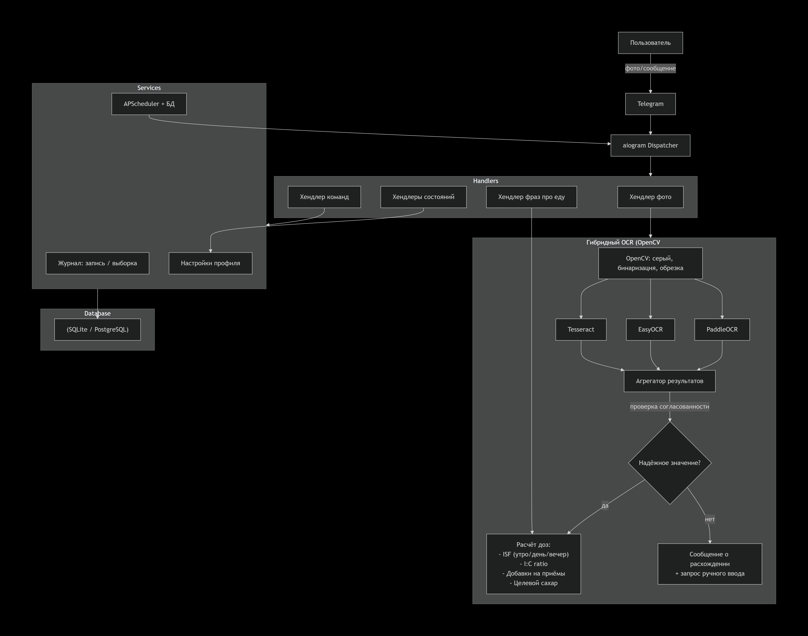

```markdown
# 🧬 uSugar - uSugarBot
### Your sugar, your rules
### Твой сахар под контролем
*Family diabetes assistant for Libre2 · Семейный помощник при диабете*

[](https://www.python.org/)
[](https://docs.aiogram.dev/)
[](./LICENSE)
[](#-roadmap)

A modular Telegram bot for **family‑based Type 1 diabetes monitoring**.  
Automatically reads glucose from Libre2 screenshots (triple OCR), calculates insulin doses using personalised formulas, tracks meals/injections, keeps a detailed log and sends reminders.  
Works seamlessly in **group chats** (admin rights required) and private messages.

Built with ❤️ for a parent managing their child’s diabetes – but designed to be used by anyone.

---

## 📑 Table of Contents

- [Key Features](#-key-features)
- [Architecture Overview](#-architecture-overview)
- [Quick Start (v1.0.0 – local)](#-quick-start-v100--local)
- [Usage & Commands](#-usage--commands)
  - [Profile Setup](#-profile-setup)
  - [Sending a Libre2 Screenshot](#-sending-a-libre2-screenshot)
  - [Meal Calculation by Phrase](#-meal-calculation-by-phrase)
  - [Manual Entry](#-manual-entry)
  - [Log & Reminders](#-log--reminders)
- [Project Structure](#-project-structure)
- [Core Modules Explained](#-core-modules-explained)
  - [Triple OCR Engine](#-triple-ocr-engine)
  - [Dosing Engine (FormulaService)](#-dosing-engine-formulaservice)
  - [Reminder & Scheduler](#-reminder--scheduler)
- [Roadmap](#-roadmap)
- [Contributing](#-contributing)
- [License](#-license)

---

## ✨ Key Features

- **📸 Triple OCR on Libre2 screenshots**  
  Uses **OpenCV** preprocessing + three independent engines (**PaddleOCR**, **EasyOCR**, **Tesseract**) to extract blood glucose. Results are compared for reliability – if they disagree by >1.0 mmol/L, the bot asks for a manual input. This eliminates silent recognition errors.

- **🧮 Smart insulin dosing**  
  - Carb‑to‑insulin ratio (I:C), may vary by meal (breakfast/lunch/dinner).  
  - Insulin sensitivity factor (ISF) – can be different for **morning/day/evening**.  
  - Fixed meal bonuses (e.g., +2.0 U for breakfast).  
  - Target glucose value.  
  - Supports both **mmol/L** and **mg/dL**.  
  - Calculates **correction dose** from current glucose and combines it with meal dose.

- **💬 Natural language meal input**  
  Write `“какой укол 45 23 67”` or `“посчитай укол завтрак 34 56”` → the bot extracts carbs, converts to bread units, calculates the required short‑acting insulin and adds correction if a recent glucose reading exists.

- **📋 Detailed journal**  
  Every glucose check (three OCR values + final chosen one), carb entry, insulin injection and note is stored. Retrieve logs for a day/week/month with `/log`, or get a CSV file when the data is too long.

- **⏰ Smart reminders**  
  Scheduled reminders for blood sugar checks, basal insulin injections and “check after 2 hours” tasks are created automatically after a meal bolus.

- **👨‍👩‍👦 Family‑group friendly**  
  Designed to be added as an **admin** in a family group. The bot listens only to relevant messages (photos with Libre2 patterns, specific commands, and key phrases) so it doesn’t spam the chat.

- **🔧 Fully configurable per chat**  
  Each group (or private chat) has its own profile configured via `/setup`.

---

## 🏗 Architecture Overview



The bot follows a modular, event‑driven architecture:

1. **Handlers** catch messages, photos, and commands.
2. **OCR Engine** preprocesses the image and runs three parallel recognitions. An **aggregator** decides whether the result is reliable.
3. **Services** (FormulaService, JournalService, ReminderService) perform business logic and interact with the database.
4. **FSM** (Finite State Machine) handles multi‑step dialogs like `/setup` and injection confirmations.
5. **Database** (SQLite in v1.0, PostgreSQL later) stores profiles, logs, reminders, and even raw OCR outputs.

Everything is asynchronous (`aiogram`, `asyncio.to_thread` for OCR) to keep the bot responsive.

---

## 🚀 Quick Start (v1.0.0 – local)

### Prerequisites
- Python 3.12+
- [Tesseract OCR](https://github.com/tesseract-ocr/tesseract) installed on your system (for the third OCR engine)

### 1. Clone & setup environment
```bash
git clone https://github.com/your-org/diabet-family-bot.git
cd diabet-family-bot
python -m venv venv
source venv/bin/activate   # Windows: venv\Scripts\activate
pip install -r requirements.txt
```

### 2. Create `.env` file
```ini
BOT_TOKEN=your_telegram_token_from_BotFather
# Optional for v2.0.1
DEEPSEEK_API_KEY=sk-...
```

### 3. Run
```bash
python bot.py
```

The bot will start polling. Add it to a test group (as admin) and send `/setup` to begin.

---

## 📟 Usage & Commands

### 🛠 Profile Setup
```
/setup
```
Walks you through:
- Units (`mmol/L` or `mg/dL`)
- Target glucose
- Bread unit (grams of carbs per 1 XE)
- Insulin Sensitivity Factor (ISF) – one value or morning/day/evening
- Carb ratio (I:C) – one value or per meal
- Fixed meal bonuses
- Basal insulin (dose, time, frequency)
- Reminders

All settings are stored per chat.

### 📷 Sending a Libre2 Screenshot
Just send the screenshot to the group (or to the bot privately). The bot will:
1. Pre‑process the image.
2. Run three OCR engines.
3. Compare results:
   - ✅ **Agreement ≤ 1.0 mmol/L** → uses the median and shows it.
   - ⚠️ **Minor discrepancy** → notifies but proceeds with the two closest.
   - ❌ **Large spread** → reports all values and asks for manual input via `/sugar`.
4. If reliable, it may ask whether you want a correction dose or, if there’s a recent meal request, it automatically combines.

### 🍽 Meal Calculation by Phrase
```
какой укол 45 23 67
посчитай укол завтрак 34 56
сколько укола обед 80
```
The bot:
- Extracts all numbers (carb grams).
- Optionally detects the meal type (`завтрак`, `обед`, `ужин`).
- Sums carbs → converts to Bread Units (XE) → calculates meal dose.
- If a reliable glucose ≤15 min old exists, adds correction dose.
- Prints the full breakdown and final recommendation.

### ✍️ Manual Entry
| Command | Example | Notes |
|---------|---------|-------|
| `/sugar 8.2` | Record a manual glucose | May trigger a correction suggestion |
| `/carbs 45` | Record carb intake (grams) | Calculates XE and suggests insulin |
| `/he 5.5` | Record Bread Units directly | Skips carb→XE conversion |
| `/insulin short 4.5` | Log a short‑acting injection | |
| `/insulin long 18` | Log a basal injection | Updates the reminder if needed |
| `/note Feeling unwell` | Add a free‑text note to the journal | |

### 📒 Log & Reminders
- `/log day` – show today’s records.
- `/log week` / `/log month` – longer periods. If the response exceeds Telegram’s limit, a **CSV file** is sent.
- `/remind 21:00 Check sugar before bed` – add a custom reminder.
- All reminders survive bot restarts (stored in database).

---

## 📂 Project Structure

```
diabet_bot/
├── bot.py                  # entry point, aiogram dispatcher
├── config.py               # loads .env
├── handlers/
│   ├── photo.py            # screenshot handling, calls OCR
│   ├── commands.py         # /start, /setup, /log, /sugar...
│   ├── food.py             # natural language meal requests
│   └── fsm.py              # multi‑step dialogs (setup, injections)
├── services/
│   ├── ocr_service.py      # OpenCV preprocessing + Paddle/Easy/Tesseract
│   ├── formula_service.py  # all insulin dose calculations
│   ├── journal_service.py  # read/write logs, generate CSV
│   └── reminder_service.py # APScheduler integration
├── db/
│   ├── models.py           # table schemas (SQL)
│   └── database.py         # async SQLite connection and init
├── states/
│   └── user_states.py      # aiogram FSM states
├── utils/
│   ├── logger.py           # loguru configuration
│   └── helpers.py          # regex, number extraction
├── .env
├── NOTE_1.0.2.MD.png       # architecture diagram
└── README.md
```

---

## 🧠 Core Modules Explained

### 🔍 Triple OCR Engine
**Why three?** A single OCR can silently misread a digit (e.g., 13.2 → 18.2). By comparing outputs from completely independent engines we catch such errors.

- **Preprocessing**:  
  - Grayscale  
  - Adaptive thresholding (highlights numbers)  
  - Crop to the glucose display area (hardcoded or auto‑detected)  
- **Engines** (all run in parallel via `asyncio.to_thread`):
  - **PaddleOCR** (primary, 92‑95% accuracy)
  - **EasyOCR** (fallback, ~85‑88%)
  - **Tesseract** with `--psm 7` (additional check)
- **Aggregation**:
  1. Extract first floating‑point number from each.
  2. Calculate max difference.
  3. If `max – min ≤ 1.0` → use median (or mean), mark `reliable = True`.
  4. If difference > 1.0 or any engine fails → notify user, save all three values with `reliable = False`.

All three raw values plus the final chosen one are stored in the `glucose_log` table for later analysis.

### 💉 Dosing Engine (FormulaService)
The engine reads per‑chat settings and time‑based coefficients to compute:
- **Meal dose**: `(total carbs / bread_unit_grams) * carb_ratio + meal_bonus`
- **Correction dose**: `(current_glucose - target_glucose) / insulin_sensitivity_factor`
- **Total**: `meal_dose + correction_dose`

It automatically selects the correct ISF and carb ratio depending on the time of day (morning/day/evening thresholds are configurable).

### ⏲ Reminder & Scheduler
Uses **APScheduler** with a SQLite job store. When the bot starts, it reloads all active reminders from the DB.  
Special behaviour:
- After a meal bolus is logged, a one‑time “check glucose in 2 hours” reminder is created.
- Basal insulin reminders fire 5 minutes before the scheduled time.

---

## 🗺 Roadmap

| Version | Focus | Status |
|---------|-------|--------|
| **1.0.0** | Local PC: triple OCR, full dosing engine, journal, reminders | ✅ In development |
| **2.0.0** | 24/7 hosting: Docker, PostgreSQL, Redis, webhook | 🔲 Planned |
| **2.0.1** | **DeepSeek API** integration: AI‑powered second opinion on doses, trend analysis, natural language explanations, internet‑based validation | 🔲 Planned |
| **3.0.0** | Food database with macros (proteins/fats/carbs) and pre‑calculated insulin, regional products | 🔲 Planned |

---

## 🤝 Contributing

We welcome improvements, bug reports, and new ideas.  
Please open an issue first to discuss what you’d like to change.  
Code style: follow PEP 8, add type hints where possible, and write tests for critical logic (OCR aggregation, formula calculations).

---

## 📄 License

This project is licensed under the MIT License – see the [LICENSE](LICENSE) file for details.

---

**Made with care for a family dealing with Type 1 diabetes.**  
For questions or suggestions, contact the maintainer or open a GitHub issue.

## 💔 The Story Behind the Project
## 💔 История, стоящая за проектом · The story behind uSugar

Всё началось не с кода, а с одной семьи из Минска.  
[Прочитать на русском](STORY_RU.md) · [Read in English](STORY_EN.md)


```